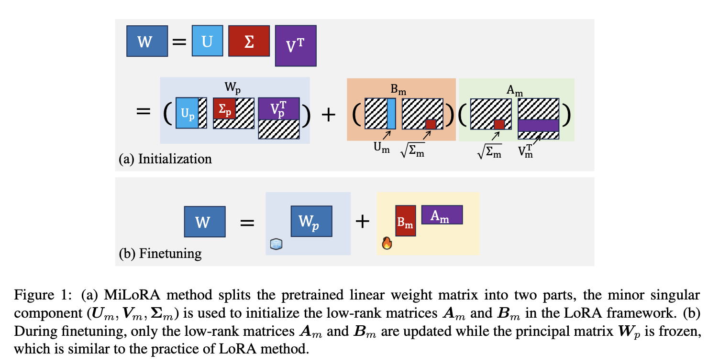
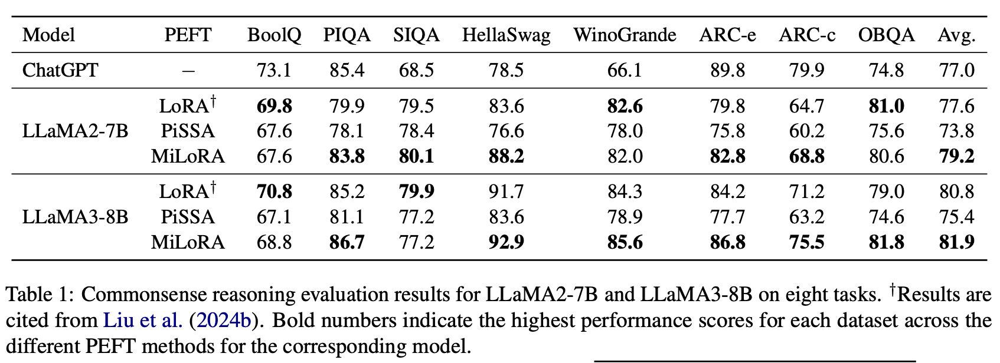
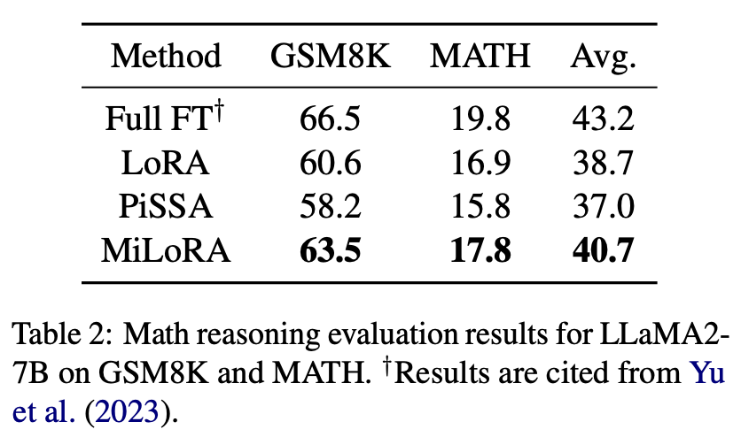
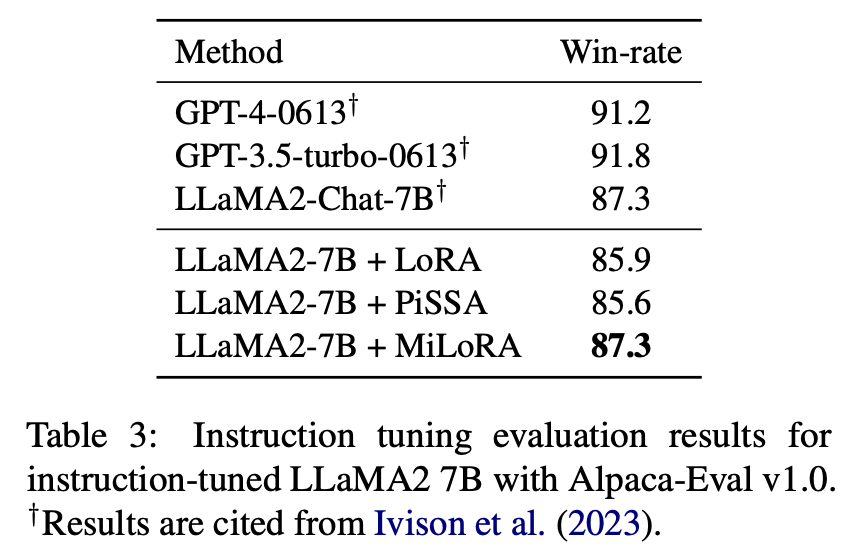
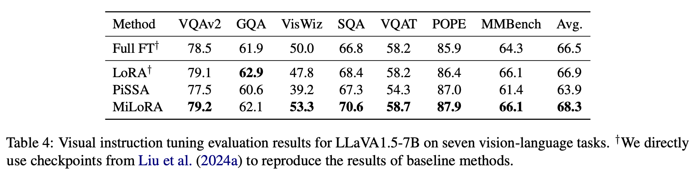
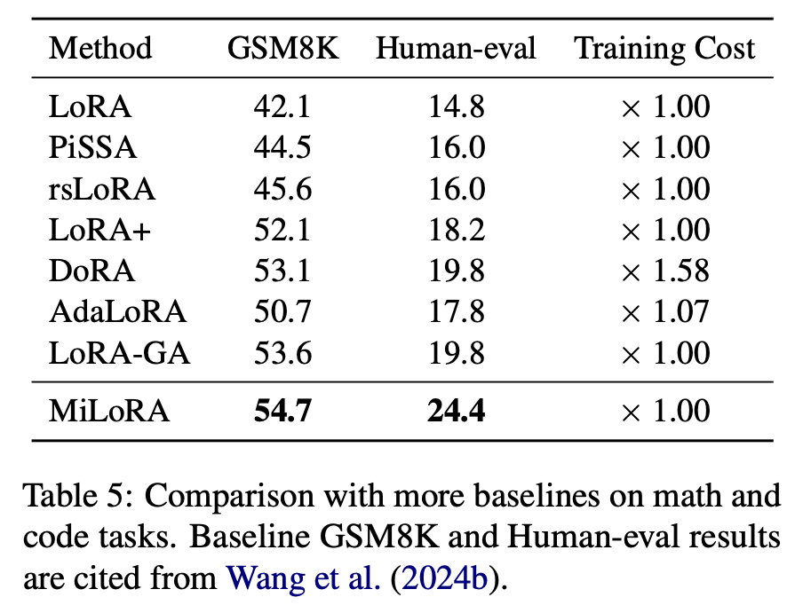

# [MiLoRA: Harnessing Minor Singular Components for Parameter-Efficient LLM Finetuning](https://arxiv.org/abs/2406.09044)

The official repository containing the introduction, code, and reproduction instructions for our paper: [MiLoRA: Harnessing Minor Singular Components for Parameter-Efficient LLM Finetuning](https://arxiv.org/abs/2406.09044).

<p align="center">
  <a href="#-news">| 🔥 News</a> |
  <a href="#-motivation">💡 Motivation</a> |
  <a href="#-milora">🌈 Method</a> |
  <a href="#-reproduce">🧪 Reproduce |</a> 
</p>

<p align="center">
  <a href="#-experiment-results">| 🔬 Results</a> |
  <a href="#-resources">🪵 Resources</a> |
  <a href="#-citation">📓 Citation</a> | 
  <a href="https://arxiv.org/abs/2406.09044">📃 Paper |</a>

</p>

# 🔥 News
- Oct 2024: We released our code and reproducing instructions.
- May 2024: We released our paper on [arxiv](https://arxiv.org/abs/2406.09044).

# 💡 Motivation
- Full-finetuning is too expensive to train.
- LoRA, the most popular parameter-efficient finetuning method and its varients, are randomly initialized.
- We argue that this strategy may override the important pretrained features, thus degrading the performance of low-rank adaptation methods.

# 🌈 MiLoRA
- To this end, we propose Minor singular component based Low Rank Adaptation (MiLoRA) for efficient LLM finetuning.
- Specifically, we use minor components of the pretrained model to initialize the LoRA.
- This strategy encourages the model to learn in the less-optimized subspace, thus reducing the interference with the well-learned pretrained knowledge encoded in the principal singular components.

<span id="MiLoRA"></span>


# 🧪 Reproduce

## 1. Commonsense Reasoning
We use the code from [LLM-Adapters repo](https://github.com/AGI-Edgerunners/LLM-Adapters) to do commensense reasoning tasks, compare to the lora implement in LLM-Adapters, we only modified it with our LoRA initialization. We diectly use their setting in other experiments without notifications.

## 2. Math Reasoning
Our math reasoning code is modified from [PiSSA](https://github.com/GraphPKU/PiSSA).

### 2.1. Train
For training peft modules on math and code tasks, we do the following preparation.
- Data(download directly in this path):
  - Math dataset: [meta-math/MetaMathQA](https://huggingface.co/datasets/meta-math/MetaMathQA)
  - Code dataset: [m-a-p/CodeFeedback-Filtered-Instruction](https://huggingface.co/datasets/m-a-p/CodeFeedback-Filtered-Instruction)
- Environment:
    ```
    conda create -n milora python=3.10.14 -y
    conda activate milora
    pip install torch==2.3.0
    pip install -r requirements.txt
    ```
- Model(for milora and pissa):
  - ```
    bash scripts/run_svd_init.sh
    ```
    See the shell file and the corresponding .py for more details.

- Train
  
  Run the following shell to train your model, modified `$save_root` to determine which path to save the checkpoints.
  - ```
    # to replicate milora results
    bash scripts/run_milora.sh $save_root

    # to replicate lora results
    bash scripts/run_lora.sh $save_root
    ```
  See the training log in `./logs`, and we also implement `report_to tensorboard` by default. Use `tensorboard --logdir $save_root` to check tensorboard output.
### 2.2. Evaluation
The GSM8K and MATH evaluations are already included in the training code, check the evaluation results in `results/gsm8k` and  `results/MATH`.


## 3. Instruction Following
We use the implementation in [open-instruct](https://github.com/allenai/open-instruct).

## 4. Visual Instruction tuning
We use the implementation in [DoRA](https://github.com/NVlabs/DoRA/tree/main/visual_instruction_tuning), for hyperparameters, we directly followed the LoRA setting in [Visual Instruction Tuning](https://proceedings.neurips.cc/paper_files/paper/2023/file/6dcf277ea32ce3288914faf369fe6de0-Paper-Conference.pdf).

# 🔬 Experiment Results
## 1. Commonsense Reasoning
<span id="Commonsense_reasoning_result"></span>


## 2. Math Reasoning
<span id="Math_reasoning_result"></span>


## 3. Instruction Following
<span id="Instruction_following_result"></span>


## 4. Visual Instruction tuning
<span id="Visual_Instruction_tuning_result"></span>


## 5. Compare with more PEFTs
<span id="Compare"></span>


# 🪵 Resources
Our checkpoints will be upload to huggingface.

# 📓 Citation
If you find this repo is useful, please cite us as:
```bibtex
@misc{wang2024miloraharnessingminorsingular,
      title={MiLoRA: Harnessing Minor Singular Components for Parameter-Efficient LLM Finetuning}, 
      author={Hanqing Wang and Yixia Li and Shuo Wang and Guanhua Chen and Yun Chen},
      year={2024},
      eprint={2406.09044},
      archivePrefix={arXiv},
      primaryClass={cs.CL},
      url={https://arxiv.org/abs/2406.09044}, 
}
```